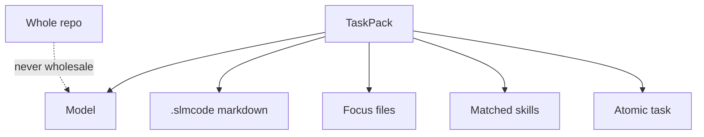

# 🧠 Concepts

The ideas behind SLMCode — so the rest of the docs feel inevitable instead of magical.

---

## <span class="slm-kicker">01</span> Harness ≠ model

A **model** predicts tokens.  
A **harness** decides *what* the model sees, *when* it acts, *how* failures recover, and *where* knowledge sticks.

Frontier tools often hide the harness behind a chat box. SLMCode makes the harness explicit:

| Layer | Owner | Job |
|-------|-------|-----|
| Routing / board | Go | Plan, schedule, stop/resume |
| Specialists | Prompts + tools | One role, one pack |
| Critic | Reviewer + disk evidence | Catch fiction |
| Memory | `.slmcode/*.md` | Compound lessons |

!!! quote "House metaphor"
    Don't ask the intern to also be the architect, QA, and filing cabinet.
    Give them a desk, a ticket, and a checklist.

---

## <span class="slm-kicker">02</span> Scoped packs (the turkey rule)

Stuffing the whole repo into context is how small models fall asleep mid-sentence.

Each specialist receives a **TaskPack**:

- slices of PROJECT / CONTEXT / MEMORY / skills
- a few focus files
- **one** atomic task
- tool allowlists that match the role



Bigger models still benefit: less noise, clearer acceptance criteria, cheaper runs.

---

## <span class="slm-kicker">03</span> Plan → split → coordinate

```text
query
  → instructions (AGENTS.md / PROJECT.md)
  → skills match
  → context agent
  → explore OR reuse memory
  → planner (multipass) → splitter → sanitize
  → coordinator advice
  → parallel execute
  → review ↔ correct
  → learn → test → evolve skills
  → session snapshot
```

The **coordinator** doesn't write code. It steers the kanban: promote, reassign, add tasks, note risks.

---

## <span class="slm-kicker">04</span> Explore reuse

Deep exploration is expensive (especially on slow local inference).

If CONTEXT is rich, MEMORY/PROJECT exist, and discovery finds relevant paths, SLMCode **skips** the deep dive and reuses knowledge.

```bash
# When memory feels stale or wrong:
SLMCODE_FORCE_EXPLORE=1 slmcode run -v "…"
```

---

## <span class="slm-kicker">05</span> Self-critic with evidence

```text
worker/deep → reviewer → (reject) → corrector → reviewer …
```

Reviewers can be flaky on SLMs. Heuristics prefer:

- clear `status: done`
- `files_changed` that match disk
- rename satisfaction when paths already moved

Disk beats vibes. Always.

---

## <span class="slm-kicker">06</span> Knowledge flywheel

After a run:

1. **MEMORY.md** — lessons / pitfalls  
2. **CONTEXT.md** — what we touched  
3. **SKILLS.md** + `skills/learned/` — conventions that stuck  
4. **sessions/** — resumable snapshots  

Tomorrow's run starts smarter than today's. That's the product.

---

## <span class="slm-kicker">07</span> Permissions are a feature

| Mode | Use when |
|------|----------|
| `auto` | You trust the loop (or it's a playground) |
| `dry-run` | Demos, CI dry checks, “what would you do?” |
| `review` | Real repos — stage patches, then `slmcode apply` |

Shell is separate: `shell_permission: allow | ask | deny`.

---

## <span class="slm-kicker">08</span> Any LLM, same loop

Providers are adapters. The harness stays constant.

- Local SLM → more `think_passes`, smaller `max_context_kb`, patience  
- Frontier → raise parallel, enjoy speed, keep inspectability  

See [Providers](providers.md) and [Config](config.md).

---

## Next

- [Quick start](quickstart.md) — feel it  
- [User guide](guide.md) — drive it daily  
- [Architecture](architecture.md) — package map for contributors  
