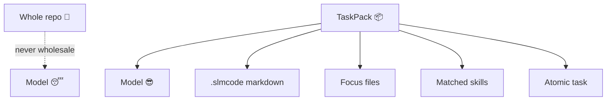

# 🧠 Concepts

The ideas behind SLMCode — so the rest of the docs feel inevitable instead of magical.
Also: fewer “why is it like this?” Slack threads. 😅

<div class="slm-banner" markdown>
<span class="slm-banner__emoji">🏠</span>
<p class="slm-banner__text" markdown>
<strong>House metaphor:</strong> don’t ask the intern to also be the architect, QA, and filing cabinet.
Give them a desk, a ticket, and a checklist. Then maybe a snack.
</p>
</div>

---

## <span class="slm-kicker">01</span> Harness ≠ model 🧰

A **model** predicts tokens.
A **harness** decides *what* the model sees, *when* it acts, *how* failures recover, and *where* knowledge sticks.

Frontier tools often hide the harness behind a chat box. SLMCode makes the harness explicit — like leaving the kitchen lights on.

| Layer | Owner | Job |
|-------|-------|-----|
| 🧭 Routing / board | Go | Plan, schedule, stop/resume |
| 🧩 Specialists | Prompts + tools | One role, one pack |
| 🔍 Critic | Reviewer + disk evidence | Catch fiction |
| 💾 Memory | `.slmcode/*.md` | Compound lessons |

!!! quote "🎤 UnicoLab watercooler"
    Models are the talent. Harnesses are the stage managers.
    Never let the talent rearrange the set mid-show.

---

## <span class="slm-kicker">02</span> Scoped packs (the turkey rule) 🦃

Stuffing the whole repo into context is how small models fall asleep mid-sentence.

Each specialist receives a **TaskPack**:

- slices of PROJECT / CONTEXT / MEMORY / skills
- a few focus files
- **one** atomic task
- tool allowlists that match the role



Bigger models still benefit: less noise, clearer acceptance criteria, cheaper runs.
(Your CFO’s favorite sentence.)

---

## <span class="slm-kicker">03</span> Plan → split → coordinate 📋

```text
query
  → instructions (AGENTS.md / PROJECT.md)
  → skills match
  → context agent
  → explore OR reuse memory
  → clarify (interview: ask|auto recommended → Locked PRD)
  → scope judge (every task gets concrete acceptance / PRD)
  → planner (multipass) → splitter → sanitize (+ auto tester task)
  → coordinator advice
  → parallel execute (worker smoke + acceptance smoke + static/claims)
  → review ↔ correct (≤ max_retries)
  → escalate HITL if stuck (timeout → @escalate SLM decides)
  → placeholder polish → completeness bar
  → finalize tester (real commands required)
  → QA gate (install deps + pytest preferred — not compileall alone)
  → continue-ask if work remains
  → learn → evolve skills → session snapshot
```

The **coordinator** doesn't write code. It steers the kanban: promote, reassign, add tasks, note risks.
Think air-traffic control, not pilot. ✈️

---

## <span class="slm-kicker">04</span> Explore reuse ♻️

Deep exploration is expensive (especially on slow local inference).

If CONTEXT is rich, MEMORY/PROJECT exist, and discovery finds relevant paths, SLMCode **skips** the deep dive and reuses knowledge.
Your fans thank you. Your GPU fans thank you louder.

```bash
# When memory feels stale or wrong:
SLMCODE_FORCE_EXPLORE=1 slmcode run -v "…"
```

---

## <span class="slm-kicker">05</span> Building blocks 🧱

SLMCode pipelines, agents, quality checks, and language packs are all **YAML-configurable building blocks** — versioned, shareable, and marketplace-ready.

```yaml
# .slmcode/blocks/pipelines/my-lang.yaml
api_version: blocks/v1
kind: pipeline
id: my-lang
name: My Pipeline
spec:
  phases:
    test: { agent: my-tester, when: always }
  execute:
    default_role: my-worker
```

**Discovery order**: project (`.slmcode/blocks/`) → user (`~/.slmcode/blocks/`) → env → builtin.
Project blocks always win, so you can override any builtin for a specific project.

**Four block kinds**:

| Kind | What it defines |
|------|----------------|
| `pipeline` | Phase graph, loop agents, slots |
| `agent` | Custom specialist or builtin override |
| `quality` | Format/lint/test/build commands |
| `pack` | Composes pipeline + quality + agents into a language pack |

Predefined packs for Go 🐹, Python 🐍, and React ⚛️ ship built-in.
Switch with `slmcode blocks apply <id>` or use the Studio's PackSelector.

→ [🧱 Full blocks reference](blocks.md)

---

## <span class="slm-kicker">05</span> Self-critic with evidence 🔍

```text
worker/deep → reviewer → (reject) → corrector → reviewer …
```

Reviewers can be flaky on SLMs. Heuristics prefer:

- clear `status: done`
- `files_changed` that match disk
- rename satisfaction when paths already moved

!!! tip "📜 Disk beats vibes"
    Always. If the file says hello and the model says goodbye — trust the file.

---

## <span class="slm-kicker">06</span> Knowledge flywheel 🦋

After a run:

1. **MEMORY.md** — lessons / pitfalls
2. **CONTEXT.md** — what we touched
3. **SKILLS.md** + `skills/learned/` — conventions that stuck
4. **sessions/** — resumable snapshots

Tomorrow's run starts smarter than today's. That's the product.
(Also: please don’t `rm -rf .slmcode` for sport.)

---

## <span class="slm-kicker">07</span> Permissions are a feature 🛡️

| Mode | Use when |
|------|----------|
| `auto` | You trust the loop (or it's a playground) 🛝 |
| `dry-run` | Demos, CI dry checks, “what would you do?” 🎭 |
| `review` | Real repos — stage patches, then `slmcode apply` (interactive) or `slmcode reject` 👀 |

Shell is separate: `shell_permission: allow | ask | deny`.
Files and shells have different blast radii. Treat them that way.

---

## <span class="slm-kicker">08</span> Any LLM, same loop 🔌

Providers are adapters. The harness stays constant.

- 🏠 Local SLM → more `think_passes`, a correct `model_profiles.<family>.context_limit`, patience
- ☁️ Frontier → raise parallel, enjoy speed, keep inspectability

See [Providers](providers.md) and [Config](config.md).

---

## Next 🗺️

- [⏱️ Quick start](quickstart.md) — feel it
- [🧭 User guide](guide.md) — drive it daily
- [🏗️ Architecture](architecture.md) — package map for contributors

☀️ Made with ♥ by [UnicoLab](https://unicolab.ai)
