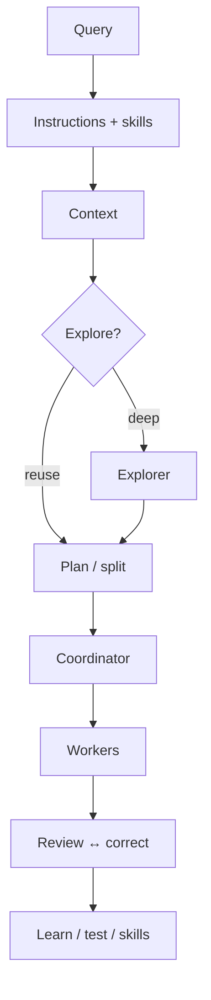

# 🧭 User guide

Daily-driving SLMCode without turning your repo into modern art.

!!! tip "Path"
    [Install](install.md) → [Quick start](quickstart.md) → [Concepts](concepts.md) → here.

---

## Day-to-day loop

```bash
cd your-project
slmcode init
# optional: AGENTS.md at repo root
# edit .slmcode/PROJECT.md

slmcode                      # premium TUI
slmcode run -v "Add validation to the login handler"
slmcode board
slmcode studio
```

| Habit | Command |
|-------|---------|
| Explore only | `run --agent explorer "…"` |
| Pin craft | `run --skill atomic-coding "…"` |
| Watch board | `watch` |
| Safe writes | `config set permission review` → `apply` |

More copy-paste → [Recipes](recipes.md).

---

## Pipeline (what happens)



Force a fresh dig: `SLMCODE_FORCE_EXPLORE=1 slmcode run -v "…"`.

Deep dive → [Concepts](concepts.md).

---

## Surfaces

| Surface | Doc |
|---------|-----|
| Premium TUI + chat | [TUI & chat](tui.md) |
| Studio GUI + API | [Studio](studio.md) |
| Full CLI | [CLI reference](cli.md) |

---

## Skills & specialists

Skills teach house style; specialists execute roles.

```bash
slmcode skills
slmcode run --skill multipass-quality "…"
slmcode run "Fix login @skill:atomic-coding"
```

→ [Skills](skills.md) · [Agents](agents.md)

---

## Project memory (the real DB)

| File | Role |
|------|------|
| `.slmcode/PROJECT.md` | Durable facts |
| `.slmcode/CONTEXT.md` | Working focus + discoveries |
| `.slmcode/MEMORY.md` | Lessons / pitfalls |
| `.slmcode/SKILLS.md` | Index + recent lessons |
| `.slmcode/skills/learned/` | Auto-grown conventions |
| `.slmcode/sessions/` | Resumable runs |
| `.slmcode/pending/` | Staged review writes |
| `AGENTS.md` / `CLAUDE.md` / `.cursorrules` | Auto-injected instructions |

```bash
slmcode context append "Prefer table-driven tests"
slmcode docs show MEMORY.md
```

---

## Permissions

| Mode | Behavior |
|------|----------|
| `auto` | Write now |
| `dry-run` | Simulate |
| `review` | Stage → `slmcode apply` |

```bash
slmcode config set permission review
slmcode run "refactor foo"
slmcode apply && slmcode diff
```

Shell: `shell_permission: allow | ask | deny` — independent of file writes.
→ [Config](config.md)

---

## Quality knobs

```bash
slmcode config set think_passes 2
slmcode config set retries 2
slmcode config set parallel 2
slmcode config set max_context_kb 16
```

| Symptom | Try |
|---------|-----|
| Wanders | Lower context, pin `atomic-coding`, stern `AGENTS.md` |
| Weak JSON | More think passes / retries; better tool-calling model |
| Too slow | Lower parallel; explore reuse; faster provider |

→ [FAQ](faq.md)

---

## Sessions & resume

```bash
slmcode session list
slmcode session resume run-…
# TUI: /stop then /resume
```

---

## Develop from a checkout

```bash
make lint && make test && make docs-build
RUN_E2E=1 make e2e
```

Made with ♥ by [UnicoLab](https://unicolab.ai)
