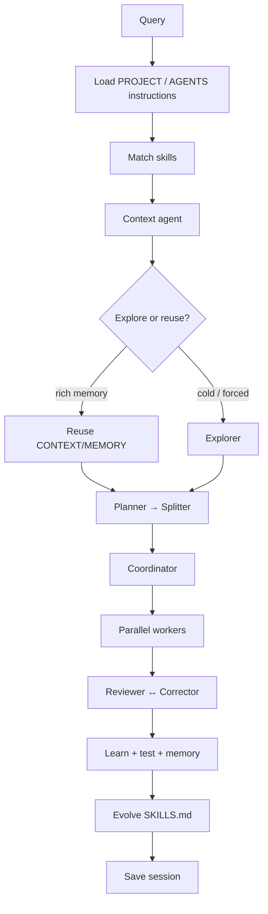

# 🧭 User guide

Daily-driving SLMCode: TUI, chat, skills, permissions, memory, and the little knobs that keep small models honest.

!!! tip "New here?"
    [Install](install.md) → [Quick start](quickstart.md) → [Providers](providers.md) → this page.

---

## 🎬 Day-to-day loop

```bash
cd your-project
slmcode init
# optional: AGENTS.md at repo root (auto-loaded)
# edit .slmcode/PROJECT.md with stack + conventions

slmcode                      # premium TUI (default)
slmcode run -v "Add validation to the login handler"
slmcode run --agent explorer "Where is auth handled?"
slmcode run --skill atomic-coding "Refactor helpers"
slmcode board
slmcode watch                # live terminal kanban
slmcode chat
slmcode studio               # http://127.0.0.1:7420
```

---

## 🧬 Pipeline (what actually happens)



Force a fresh deep explore when memory feels stale:

```bash
SLMCODE_FORCE_EXPLORE=1 slmcode run -v "…"
```

---

## ⌨️ CLI cheat sheet

| Command | Purpose |
|---------|---------|
| `init` / `doctor` / `config` | Workspace + provider health |
| `run -v` | Full pipeline + live stream |
| `tui` / bare `slmcode` | Premium interactive TUI |
| `chat` | Classic REPL |
| `board` / `watch` | Colored kanban |
| `task …` | add / show / edit / move / delegate / promote |
| `context` / `docs` / `plan` / `skills` | Markdown memory |
| `session list` / `resume` | Time travel (sort of) |
| `diff` / `commit` | Inspect & land changes |
| `studio` | GUI + SSE API |
| `update` | Refresh install |

### Handy run flags

```bash
slmcode run --think-passes 2 --parallel 3 --retries 2 "…"
slmcode run --agent explorer "…"
slmcode run --skill multipass-quality "…"
slmcode run "Fix login @skill:atomic-coding"
```

---

## 🖥️ Premium TUI

```bash
slmcode
# or
slmcode tui
```

Slash commands worth tattooing on your muscle memory:

| Command | Effect |
|---------|--------|
| `/compact` | Shrink context noise |
| `/sessions` | Browse runs |
| `/stats` | Latency / tokens |
| `/permission` | Write / shell policy |
| `/agents` | List / CRUD agents |
| `/stop` | Checkpoint mid-run |
| `/resume` | Continue from checkpoint |

!!! note "Ctrl+C mid-run"
    Checkpoints board + ReAct history under `.slmcode/queries/<id>/react/`. `/resume` continues — not a cold replan from the void.

---

## 💬 Chat REPL

```bash
slmcode chat
```

| Command | Effect |
|---------|--------|
| `/help` | List commands |
| `/run <q>` | Full pipeline |
| `/board` `/status` `/diff` `/skills` `/doctor` | Inspect |
| `/permission auto\|dry-run\|review` | Write policy |
| `/model <id>` | Switch model |
| `/quit` | Exit |

Plain lines (no `/`) also run the full pipeline. Yes, you can just talk to it.

---

## 🦋 Skills

Every specialist ships with a bundled `specialist-<role>` skill, plus shared packs like `atomic-coding`, `markdown-memory`, `multipass-quality`.

```yaml
---
name: my-skill
description: How we do the thing around here
triggers: keyword1, keyword2
agents: worker, reviewer   # or * / omit for all
user-invocable: true
---
```

| Action | How |
|--------|-----|
| List | `slmcode skills` / Studio → Skills |
| Create | `slmcode skills new my-skill --agents worker` |
| Edit | `slmcode skills edit my-skill` → `.slmcode/skills/` |
| Reference | `@skill:name` or `/skill name` in the query |
| Pin | `--skill name` · Studio chips · `config.pinned_skills` |
| Full engine | `mode: full` (default) |
| One specialist | `--agent worker` or `mode: specialist` |

---

## 🧠 Shared project knowledge

| File | Role |
|------|------|
| `.slmcode/PROJECT.md` | Durable project facts |
| `.slmcode/CONTEXT.md` | Working focus + discovered files + wave deltas |
| `.slmcode/MEMORY.md` | Lessons / pitfalls (“never trust that helper”) |
| `.slmcode/SKILLS.md` | Auto index of skills + latest lessons |
| `.slmcode/skills/learned/SKILL.md` | Auto-grown conventions |
| `.slmcode/sessions/*.json` | Resumable runs |
| `.slmcode/pending/` | Staged writes when `permission=review` |
| `AGENTS.md` / `CLAUDE.md` / `.cursorrules` | Auto-injected instructions |

```bash
slmcode context append "Prefer table-driven tests"
slmcode docs show MEMORY.md
```

---

## 🔐 Permissions (don't yeet production by accident)

| Mode | Behavior |
|------|----------|
| `auto` | Write immediately |
| `dry-run` | Never write (simulate — great for demos) |
| `review` | Stage under `.slmcode/pending/` → `slmcode apply` |

```bash
slmcode config set permission review
slmcode run "refactor foo"
slmcode apply
slmcode diff
slmcode commit -m "slmcode: refactor foo"
```

Shell tool modes (`ws_shell`): `allow` | `ask` | `deny` — independent of file writes.

---

## 🎛️ Quality knobs (especially for SLMs)

```bash
slmcode config set think_passes 2   # draft → critique → refine
slmcode config set parallel 3
slmcode config set retries 2
slmcode config set max_context_kb 16
```

More passes ≠ always better. Sometimes it just means more confident nonsense. Dial with taste.

---

## 🧩 Specialists

See [Agents](agents.md) for the full roster (14 roles), custom agents, and coordinator actions.

---

## 🧪 From a checkout

```bash
make lint && make test
RUN_E2E=1 make e2e
```

Made with ♥ by [UnicoLab](https://unicolab.ai)
