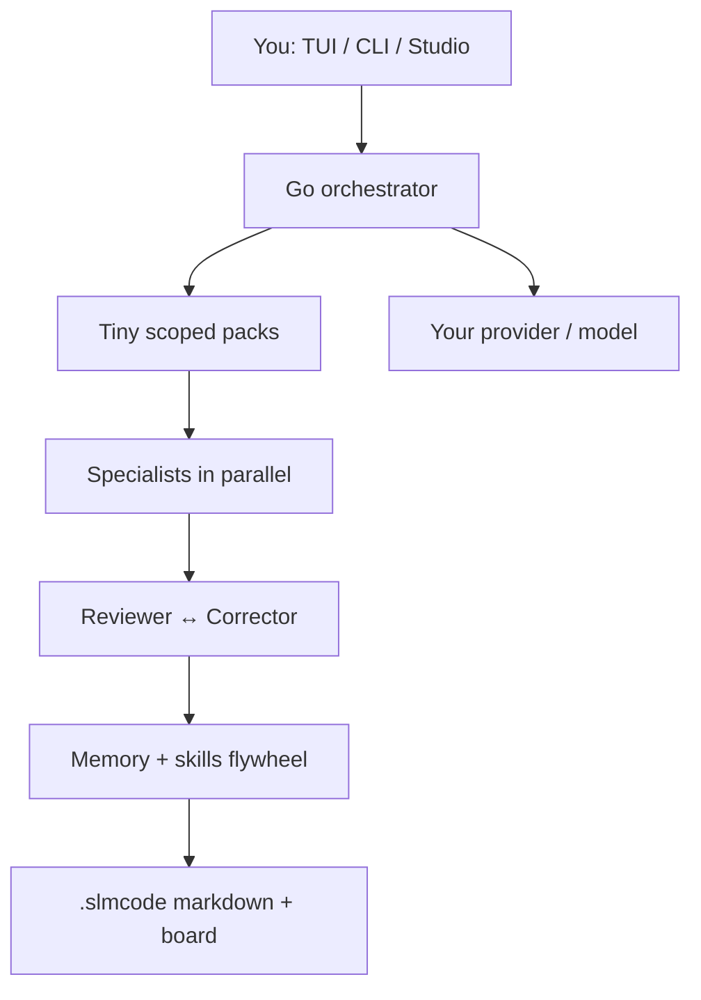

# ⚡ SLMCode

**A coding harness that loves SLMs — and works with any LLM.**

Plan → atomic tasks → parallel specialists → self-critic → learn.
Live TUI + offline Studio. Defaults to **oMLX**. Plugs into Ollama, OpenAI, OpenRouter, vLLM, your weird corporate gateway… whatever speaks chat completions.

[Install](install.md){ .md-button .md-button--primary }
[Quick start](quickstart.md){ .md-button }
[GitHub](https://github.com/UnicoLab/smlcode){ .md-button }

---

## 🌅 Why does this exist?

LLMs are incredible. Coding with them inside a good harness feels like magic.

Then the industry shipped a wave of specialized agents — Claude Code, Antigravity, Pi, and friends — all tuned for **frontier models**: huge context, strong tool-calling, expensive tokens.

That is fantastic… until you run out of tokens.
And eventually, **you will**.

Point the same harness at a local **SLM** and the magic often evaporates: wandering edits, broken JSON, context overflow, reviewers that green-light fiction.

!!! tip "SLMCode's job"
    Fill those gaps. Keep the ambition of the big harnesses. Add structure, evidence gates, multipass, and feedback loops so small models (and big ones) can actually ship.

Built because summer coding with SLMs should feel like a superpower, not a compromise. ☀️

---

## 🗺️ Pick your adventure

-   :material-download:{ .lg .middle } **Install**

    ---

    One-liners for macOS, Linux, Windows + Homebrew.

    [:octicons-arrow-right-24: Get on PATH](install.md)

-   :material-rocket-launch:{ .lg .middle } **Quick start**

    ---

    From zero to first green run in about a minute.

    [:octicons-arrow-right-24: Ship something tiny](quickstart.md)

-   :material-connection:{ .lg .middle } **Providers**

    ---

    oMLX, Ollama, OpenAI, OpenRouter, or *your* gateway.

    [:octicons-arrow-right-24: Plug in any model](providers.md)

-   :material-compass:{ .lg .middle } **User guide**

    ---

    TUI, chat, skills, permissions, day-to-day workflow.

    [:octicons-arrow-right-24: Daily driving](guide.md)

-   :material-palette:{ .lg .middle } **Studio**

    ---

    Offline GUI, kanban, live SSE, HTTP API.

    [:octicons-arrow-right-24: Open the cockpit](studio.md)

-   :material-robot:{ .lg .middle } **Agents**

    ---

    14 specialists, custom agents, per-agent providers.

    [:octicons-arrow-right-24: Meet the crew](agents.md)

---

## 🧠 Mental model (the 30-second version)

Routing stays in **Go**. Models get **tiny packs**, not the whole monorepo stuffed into a prompt like a Thanksgiving turkey.

---

## ✨ What you get

| Feature | Why you'll care |
|---------|-----------------|
| 🧭 Atomic planning | Tasks sized for ~30B brains (frontier models still love this) |
| 🗂️ Live kanban | See the work; drag it mid-run |
| 🧩 14 specialists | Explorer, architect, worker, reviewer, tester… |
| 🔁 Self-critic | Reject → correct → retry, with disk evidence |
| 🧠 Markdown memory | CONTEXT / MEMORY / SKILLS that compound |
| ⚡ Early-exit streams | Stop wasting decode once JSON is done |
| 🖥️ Premium TUI + Studio | Terminal joy *and* a real GUI |
| 🔌 Any provider | Local or cloud — same harness |

---

## 💖 UnicoLab

SLMCode is part of the [UnicoLab](https://unicolab.ai) open toolkit — local-first agents that stay private, inspectable, and affordable.

!!! quote "House rule"
    If a doc page could belong to another product after you remove the logo… we failed. Same for the harness: if it only works with one megacorp model, we failed harder.
