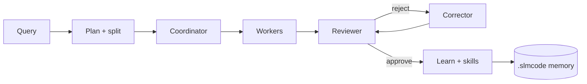

<div class="slm-hero" markdown>

<div class="slm-hero__eyebrow" markdown>:material-lightning-bolt: UnicoLab · open harness</div>

# Coding agents that still work when tokens run out

<p class="slm-hero__lead" markdown>
A **premium coding harness** tuned for SLMs — with the ambition of frontier tools —
and a clean plug for **any** OpenAI-compatible LLM. Plan, specialize, criticize, learn.
</p>

<div class="slm-hero__actions" markdown>
[Install now](install.md){ .md-button .md-button--primary }
[60-second start](quickstart.md){ .md-button }
[How it thinks](concepts.md){ .md-button }
</div>

<div class="slm-hero__meta" markdown>
<span class="slm-pill">:material-apple: oMLX default</span>
<span class="slm-pill">:material-console: Premium TUI</span>
<span class="slm-pill">:material-palette-outline: Offline Studio</span>
<span class="slm-pill">:material-connection: Any provider</span>
<span class="slm-pill">:material-heart: UnicoLab</span>
</div>

</div>

## Why SLMCode exists

Frontier coding agents are wonderful — until the meter spins and the context window becomes a landfill.

Small local models need a **different loop**: atomic tasks, evidence gates, markdown memory, and a critic that looks at the disk, not just the vibes.

!!! tip "The pitch in one breath"
    Keep the ambition of Claude Code / Antigravity / Pi-style harnesses.
    Fill the gaps so **7B–30B models** (and bigger ones) can ship — maybe with longer passes —
    without pretending they can swallow your monorepo whole.

---

## Start here

<div class="grid cards" markdown>

-   :material-download:{ .lg .middle } **Install**

    ---

    One-liners for macOS, Linux, Windows + Homebrew. No Go required.

    [:octicons-arrow-right-24: Get on PATH](install.md)

-   :material-rocket-launch:{ .lg .middle } **Quick start**

    ---

    Init a playground, run a tiny task, open Studio. Feel the loop.

    [:octicons-arrow-right-24: First green run](quickstart.md)

-   :material-brain:{ .lg .middle } **Concepts**

    ---

    Why scoped packs beat “paste the repo”. Explore reuse. Self-critic. Flywheel.

    [:octicons-arrow-right-24: Mental model](concepts.md)

-   :material-connection:{ .lg .middle } **Providers**

    ---

    oMLX, Ollama, OpenAI, OpenRouter, vLLM, or your private gateway.

    [:octicons-arrow-right-24: Plug a brain in](providers.md)

-   :material-book-open-page-variant:{ .lg .middle } **Handbook**

    ---

    Daily guide, TUI, skills, Studio, agents, battle-tested recipes.

    [:octicons-arrow-right-24: User guide](guide.md)

-   :material-api:{ .lg .middle } **Reference**

    ---

    Full CLI, `config.yaml`, FAQ, and “why is doctor red?” triage.

    [:octicons-arrow-right-24: CLI reference](cli.md)

</div>

---

## The loop (30 seconds)



Routing stays in **Go**. Models get **tiny packs**. Memory compounds on disk.
You stay in the TUI or Studio — not in a black box.

---

## What “premium” means here

| Promise | Reality check |
|---------|----------------|
| Live visibility | Agent, scope, patches, latency — not a spinner cult |
| Recoverable runs | `/stop` → checkpoint → `/resume` |
| Safety rails | `dry-run` / `review` / shell allow·ask·deny |
| Model-agnostic | Same harness for local SLM or cloud frontier |
| Offline Studio | Vendored UI; cafe Wi‑Fi optional |

---

## One-liner (because of course)

=== "macOS / Linux"

    ```bash
    curl -fsSL https://raw.githubusercontent.com/UnicoLab/smlcode/main/scripts/install-remote.sh | bash
    ```

=== "Windows"

    ```powershell
    irm https://raw.githubusercontent.com/UnicoLab/smlcode/main/scripts/install.ps1 | iex
    ```

=== "Homebrew"

    ```bash
    brew install --formula https://raw.githubusercontent.com/UnicoLab/smlcode/main/Formula/slmcode.rb
    ```

Then: `slmcode doctor` → [Quick start](quickstart.md).

---

<p class="slm-footer-note" markdown>
Made with ♥ by [UnicoLab](https://unicolab.ai) · Summer coding with SLMs should feel like a superpower, not a compromise. ☀️
</p>
