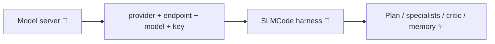

# 🔌 Providers

SLM-first defaults. Generic harness underneath.
If it speaks **OpenAI Chat Completions** (or Ollama’s native API), you’re in. 🎟️

<div class="slm-banner" markdown>
<span class="slm-banner__emoji">🧠</span>
<p class="slm-banner__text" markdown>
<strong>Mental model:</strong> the harness owns structure. The model owns tokens.
Swap brains without rewriting the play. Bring your own GPU drama.
</p>
</div>

---

## The adapter picture 🖼️



---

## Quick switches ⚡

=== "🍎 oMLX"

    ```bash
    slmcode config set provider omlx
    slmcode config set model Qwen3-Coder-30B-A3B-Instruct-MLX-4bit
    slmcode doctor
    ```

=== "🦙 Ollama"

    ```bash
    slmcode run --provider ollama --model qwen2.5-coder:14b \
      --endpoint http://127.0.0.1:11434 "Fix the flaky test"
    ```

=== "🖥️ LM Studio / vLLM"

    ```bash
    slmcode run --provider lmstudio --model local-coder \
      --endpoint http://127.0.0.1:1234/v1 "…"
    ```

=== "☁️ OpenAI"

    ```bash
    slmcode run --provider openai --model gpt-4o-mini \
      --endpoint https://api.openai.com/v1 \
      --api-key "$OPENAI_API_KEY" "…"
    ```

=== "🌈 OpenRouter"

    ```bash
    export SLMCODE_PROVIDER=openrouter
    export SLMCODE_MODEL=anthropic/claude-3.5-sonnet
    export SLMCODE_ENDPOINT=https://openrouter.ai/api/v1
    export SLMCODE_API_KEY=…
    slmcode run -v "…"
    ```

Persist:

```bash
slmcode config set provider ollama
slmcode config set model qwen2.5-coder:14b
slmcode config set endpoint http://127.0.0.1:11434
```

Studio → **Settings** writes the same file. One source of truth. Less “which config is lying?”.

---

## Stacks (presets) 📦

Named YAML packs under `stacks/*.yaml` set **global** provider/model + harness knobs.
They merge into `.slmcode/config.yaml` without wiping `listen`, `skills_dirs`, MCP, or API keys.

```bash
slmcode stack list
slmcode stack show omlx-local
slmcode stack apply deepseek
slmcode stack apply openai --agents          # also write optional per-role pins
slmcode stack apply ollama-local --clear-agent-llm  # agents inherit new stack
```

Studio → **Settings → Model Stack** calls `POST /api/stacks/{id}/apply` (same merge).

Optional `agents:` block in a stack YAML pins roles (applied only with `--agents` /
“Apply stack agent defaults”). Empty agent fields always mean **inherit the stack**.

`active_stack` in config tracks the last applied preset for UI highlighting.

### Auth, scoped models, costs

| Knob | Purpose |
|------|---------|
| `.slmcode/auth.json` | Provider keys separate from `config.yaml` (`/auth set`, `PUT /api/auth`) |
| `enabled_models` | Optional allow-list for `GET /api/models` + Studio picker |
| `llm_retry_count` / `llm_retry_delay_ms` | Provider HTTP retries (≠ board `max_retries`) |
| Catalog costs | Ballpark `$/MTok` on model search; usage `$` also uses `price_preset` |

```bash
slmcode tui
# /models gpt
# /auth set sk-...
```

---

## Built-in presets 🗂️

| Provider | Default endpoint | Notes |
|----------|------------------|-------|
| `omlx` | `http://127.0.0.1:8000/v1` | Default on Apple Silicon 🍎 |
| `ollama` | `http://127.0.0.1:11434` | Native Ollama API 🦙 |
| `lmstudio` | `http://127.0.0.1:1234/v1` | OpenAI-compat |
| `openai` | `https://api.openai.com/v1` | Needs key 🔑 |
| `openrouter` | `https://openrouter.ai/api/v1` | Many models 🌈 |
| `groq` | `https://api.groq.com/openai/v1` | Fast ⚡ |
| `together` | `https://api.together.xyz/v1` | |
| `deepseek` | `https://api.deepseek.com` | OpenAI-compat client appends `/v1` |
| `mistral` | `https://api.mistral.ai/v1` | |
| `fireworks` | `https://api.fireworks.ai/inference/v1` | |
| `gemini` / `google` | Google OpenAI-compat URL | |
| `vllm` / `litellm` / `custom` | `http://127.0.0.1:8000/v1` | Self-hosted |
| **anything else** | you set `endpoint` | Treated as OpenAI-compat ✨ |

!!! tip "🎁 Unknown names are features"
    `provider: my-corp-gateway` + `endpoint` + key just works.
    Fancy DNS optional.

---

## API keys 🔑

1. `--api-key` / `config.api_key`
2. `SLMCODE_API_KEY`
3. Provider env (`OPENAI_API_KEY`, `OPENROUTER_API_KEY`, `OMLX_API_KEY`, …)
4. oMLX `~/.omlx/settings.json`

!!! danger "🚨 Please don't"
    Commit keys. Future-you will sigh in stereo. HR will invent new verbs.

---

## Per-agent providers 🧩

Cheap local explorer + sharper cloud reviewer = budget diplomacy.

```bash
/agent edit reviewer provider=openai model=gpt-4o-mini endpoint=https://api.openai.com/v1
/agent edit worker provider=ollama model=qwen2.5-coder:14b
```

YAML: `.slmcode/agents/<id>.yaml`. Unique backend keys prevent gateway mix-ups
(“why is my local worker billing OpenAI?” — never again).

---

## Knobs by model size 📏

| Class | Try |
|-------|-----|
| 🐣 7–14B SLM | `think_passes 2`, low context KB, `retries 2+`, `parallel 1` |
| 🐦 ~30B | Defaults |
| 🦅 Frontier | Raise parallel; keep `permission: review` on serious repos |

→ [⚙️ Config](config.md) · [🧪 Recipes](recipes.md) · [❓ FAQ](faq.md)

☀️ Made with ♥ by [UnicoLab](https://unicolab.ai)
