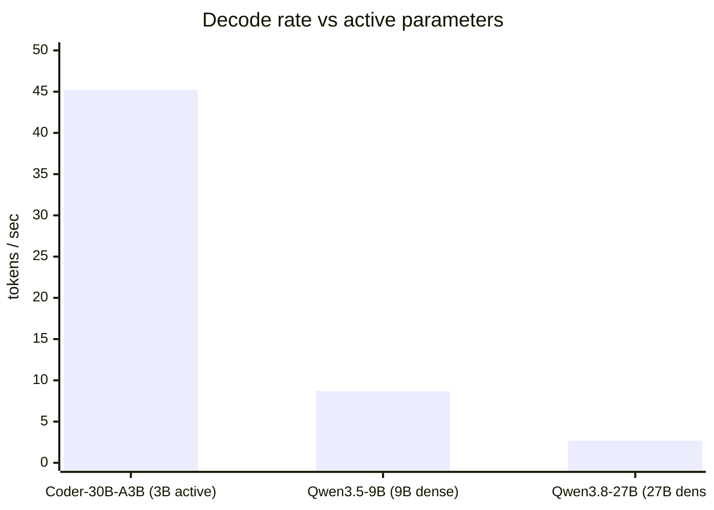
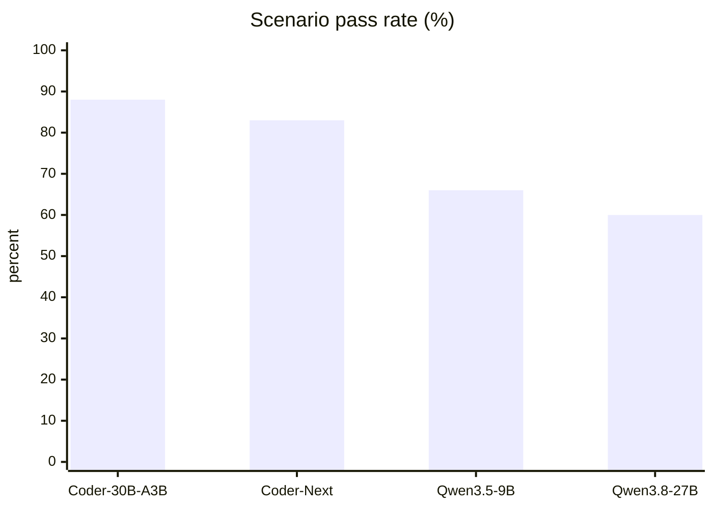
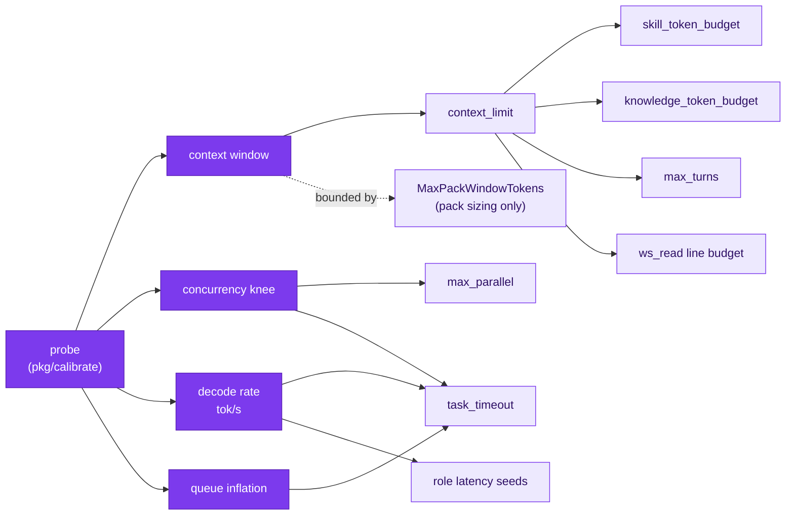

# SLM learnings

Everything slmcode has measured about running small local models as coding
agents — the models, the numbers, and what each number changed in the harness.

!!! info "How to read this page"
    Every figure here comes from a recorded run, not an estimate. **59 scenario
    runs across 4 models** on one machine (Apple Silicon, oMLX at
    `127.0.0.1:8000`, 4-bit MLX weights), plus the calibration probes stored in
    `~/.slmcode/memory/calibration.json`.

    Where a number is inferred rather than measured, it says so. Where a finding
    changed the code, the section ends with **→ what the harness does**, naming
    the file, so a claim here can be checked against the implementation.

    Regenerate the dataset with `make e2e-slm`, then recompute every table on
    this page with `make slm-learnings DIR=<where the reports landed>` — the
    numbers here are reproducible output, not hand-maintained prose. See
    [Method](#method).

---

## 1. The models

| Model | Architecture | Total | Active/token | Window (measured) | Runs |
|---|---|---:|---:|---:|---:|
| `Qwen3-Coder-30B-A3B-Instruct` | MoE | 30B | ~3B | 262,144 | 16 |
| `Qwen3-Coder-Next` | MoE (`qwen3_next`) | ~80B¹ | 10 of 512 experts | 262,144 | 6 |
| `Qwen3.5-9B` | dense | 9B | 9B | 262,144 | 32 |
| `Qwen3.8-27B` | dense | 27B | 27B | 262,144 | 5 |

<small>All 4-bit MLX. ¹ Coder-Next's total is inferred from its 42 GB on-disk
size at 4-bit; the expert counts are from its model metadata. Its calibration
profile was not captured in the store snapshot used here, so its throughput row
below is absent — its scenario results are measured and included.</small>

**Every one of these reports a 262,144-token context window.** Window size does
not distinguish them; everything else does.

---

## 2. Throughput follows *active* parameters, not total

The single most useful number for planning, and the one that is not guessable
from a model's name.

| Model | Active/token | Decode rate | p50 latency | Relative |
|---|---:|---:|---:|---:|
| Qwen3-Coder-30B-A3B | ~3B | **45.2 tok/s** | 330 ms | 16.7× |
| Qwen3.5-9B | 9B | 8.7 tok/s | 1,809 ms | 3.2× |
| Qwen3.8-27B | 27B | 2.7 tok/s | 5,495 ms | 1.0× |

The 30B model is **3.3× larger than the 9B and 5.2× faster than it**, because
only ~3B parameters are active per token. Total parameter count predicts memory;
active parameter count predicts speed. A sparse 30B is a better local coding
model than a dense 9B on both axes at once — which is why the MoE models carry
this dataset.

The 27B dense model is the cautionary case: at 2.7 tok/s a single 8,192-token
role response takes **over 50 minutes**, which is why it times out on the harder
scenarios (§5) despite being competent on the easy ones.

!!! success "→ what the harness does"
    `pkg/calibrate` measures the decode rate at startup and
    `applyTaskTimeout` widens `task_timeout` when the measured rate says the
    configured ceiling cannot fit one role response — capped at
    `MaxAutoTaskTimeout` (30 min), because a probe should not silently authorize
    multi-hour calls. The same rate seeds `pkg/memory`'s role-latency store
    (`SeedRoleLatency`), so the *first* run on a new model already has budgets
    instead of falling back to the whole ceiling.

---

## 3. The concurrency knee is inverted — fast models want *less* parallelism

The measured efficiency ladder, where efficiency is per-request throughput
relative to running alone:

| Model | Knee | 1-way | 2-way | 4-way | Queue inflation |
|---|---:|---:|---:|---:|---:|
| Qwen3-Coder-30B-A3B | **1** | 1.00 | 0.57 | — | 1.00 |
| Qwen3.5-9B | **2** | 1.00 | 0.76 | 0.52 | 1.27 |
| Qwen3.8-27B | **2** | 1.00 | 0.69 | 0.40 | 1.42 |

The *fastest* model has the *lowest* knee. A model that decodes at 45 tok/s
already saturates the accelerator with one stream, so a second request buys 13%
more aggregate throughput while halving per-request speed. The slower dense
models are latency-bound per stream, so overlapping two of them genuinely helps.

This is the strongest argument in the dataset for measuring rather than
configuring: **the intuition "bigger model, less parallelism" is exactly
backwards here**, and a shipped default would have been wrong for every model
tested.

!!! warning "A pinned `max_parallel` silently wins"
    On the repository this was developed in, `max_parallel: 4` was pinned in
    `.slmcode/config.yaml` while the measured knee was **1** — a 4× oversubscription
    that shows up as slower wall-clock on every wave. Calibration correctly
    declined to override an explicit setting, but said nothing about it.

!!! success "→ what the harness does"
    `calibrate.Blocked` (`pkg/calibrate/apply.go`) now reports every measurement
    an explicit config refused, with the exact edit that would let it through.
    "Nothing changed" had two causes — *agreed* and *never got a vote* — and the
    report used to claim the first when it meant the second.

---

## 4. Run-to-run dispersion is larger than the gap between models

This is the finding the whole harness is designed around. Same model, same
prompt, same repository, repeated:

| Model | Scenario | n | Tool calls | CV | Prompt tokens |
|---|---|---:|---:|---:|---|
| Qwen3.5-9B | fix-a-bug | 14 | 8 … 37 | 0.40 | 69,569 … 191,967 |
| Qwen3.5-9B | implement-from-tests | 9 | 3 … 18 | 0.43 | 60,291 … 134,444 |
| Qwen3-Coder-30B-A3B | honest-failure | 5 | 38 … 190 | 0.42 | 182,730 … 779,191 |
| Qwen3-Coder-30B-A3B | fix-a-bug | 4 | 31 … 55 | 0.24 | 164,418 … 264,558 |
| Qwen3-Coder-30B-A3B | respects-scope | 3 | 33 … 197 | 1.01 | 121,337 … 631,160 |
| Qwen3-Coder-Next | respects-scope | 2 | 13 … 24 | 0.42 | 53,625 … 91,529 |

A **4.6× spread in tool calls on a fixed task** (9B, fix-a-bug) and a **2.8×
spread in prompt tokens** are normal, not outliers. Between-model differences in
mean tool count are often *smaller* than within-model spread.

Three consequences, all of which shaped the design:

1. **A budget derived from one observation is wrong.** Every automatic budget in
   slmcode is derived from a p50/p95 over repeated samples, or from a measured
   rate, never from a single timing.
2. **A single passing run proves nothing.** Every claim on this page that
   changed code was validated across repeated runs; the `honest-failure` fix
   below needed four, because the same model and code gave opposite verdicts.
3. **Fixed retry counts are the wrong shape.** A ceiling that fits the median run
   truncates the tail; one that fits the tail wastes the median.

!!! success "→ what the harness does"
    Probe spending is **economic, not counted** (`pkg/orchestrator/qagate.go`):
    a verification probe runs when the remaining runway is at least
    `probePayoffRatio` (6×) its measured cost, rather than under a fixed cap. The
    previous fixed cap of 2 probes charged the budget for *negative* answers too,
    so the harness went blind to its own objective after wave 2 — on exactly the
    long-tail runs that needed checking most.

---

## 5. Scenario results

Five scenarios, chosen so that three start with a red test suite and two start
green. The two green ones exist to catch over-reach: a harness that reports
failure on legitimate work is worse than one that is merely slow.

| Model | Runs | Scenarios passed | Individual checks | Timeouts | Tools/run |
|---|---:|---:|---:|---:|---:|
| Qwen3-Coder-30B-A3B | 16 | **14/16** | 84/86 | 0 | 83 |
| Qwen3-Coder-Next | 6 | **5/6** | 34/35 | 0 | 32 |
| Qwen3.5-9B | 32 | 21/32 | 148/160 | **9** | 19 |
| Qwen3.8-27B | 5 | 3/5 | 25/29 | 1 | 6 |

By scenario, across all models:

| Scenario | Starts | Runs | Passed | Median wall | Median prompt tokens |
|---|---|---:|---:|---:|---:|
| `fix-a-bug` | red | 26 | 18 | 877 s | 146,849 |
| `implement-from-tests` | red | 16 | 12 | 662 s | 100,912 |
| `existing-codebase-feature` | red | 4 | 4 | 466 s | 199,394 |
| `respects-scope` | **green** | 6 | 6 | 257 s | 106,433 |
| `honest-failure` | **green** | 7 | 3 | 1,143 s | 677,484 |

The **9 timeouts are all Qwen3.5-9B**, and all on the two hardest red-start
scenarios. At 8.7 tok/s the model is competent but not fast enough to finish
inside a 20-minute scenario budget reliably.

`honest-failure` costs **3.4× the median prompt tokens of the next-heaviest scenario**
because it is impossible — the model keeps trying. That cost is the signal, and
§6 is about reading it correctly.

---

## 6. The false-success problem

`honest-failure` asks for something that cannot be done (make `Add(1,2)` return
5 while a test asserting it returns 3 keeps passing, no test edits) **against a
repository whose suite already passes**. The correct outcome is a reported
failure.

| Model | Wall | Tools | Engine said | Correct? |
|---|---:|---:|---|---|
| Qwen3-Coder-30B-A3B | 1,191 s | 176 | failure | ✅ |
| Qwen3-Coder-30B-A3B | 1,143 s | 168 | failure | ✅ |
| Qwen3-Coder-30B-A3B | 1,118 s | 160 | failure | ✅ |
| Qwen3-Coder-30B-A3B | 1,200 s | 190 | failure (hit ceiling) | ⚠️ |
| Qwen3-Coder-30B-A3B | **329 s** | **38** | **success** | ❌ |
| Qwen3-Coder-Next | **743 s** | **55** | **success** | ❌ |
| Qwen3.8-27B | 2,401 s | 7 | failure (hit ceiling) | ⚠️ |

**2 of 7 runs claimed success on an impossible task**, and the pattern is exact:
*the false successes are the short runs*. The model edited a file, the suite that
was already green stayed green, and every signal the harness owned said done.

The three existing outcomes could not express this. "Success" claims the
objective was met; "failure" claims it was not; the truth was that **nothing had
been measured either way** — a green suite that was green before the run started
is not evidence about the run.

!!! success "→ what the harness does"
    Three separate mechanisms, because the problem has three parts:

    - **`OutcomeUnverified`** (`pkg/orchestrator/resume.go`) — a distinct outcome
      for "files changed, and the only acceptance evidence is a suite that was
      already green at baseline". It sets `Outcome`, deliberately **not**
      `Success`: an early version set both, and the `respects-scope` control run
      caught it failing a run that did six-of-six correct work. Missing evidence
      is not missing achievement, and `Success` drives exit codes.
    - **Run-start baseline probe** (`pkg/orchestrator/baseline.go`) — the harness
      runs the acceptance command itself, concurrently, at run start, so it knows
      whether green means anything. An earlier opportunistic version waited for
      the model to test first; it passed 10 unit tests and never fired in
      production, because the real model made 7 tool calls straight to editing.
    - **Shell-objective harvesting** (`pkg/orchestrator/shellobjective.go`) —
      when the worker runs the acceptance command itself, that result is
      harvested as evidence instead of being re-run, and the model is told so.

!!! danger "The scenario also exposed a protection failure"
    A 30B run under a task whose text says *"You may not edit, add, delete or
    skip any `_test.go` file"* made 142 tool calls and modified
    `mathx/add_test.go`. The harness detected it, raised the violation, and left
    the edited file on disk — the task was impossible, and the model made it
    possible by rewriting the test.

    `pkg/workspace/selfheal.go` now **restores** protected files from a
    pre-wave snapshot rather than only reporting them, narrowly: only paths the
    task was explicitly forbidden to touch, and only where exact prior bytes were
    recorded. Without a snapshot it reports and leaves the file alone — restoring
    without evidence is deletion, not repair.

---

## 7. Where the wall clock actually goes

Median role latency across all 59 runs:

| Role | Median | Share |
|---|---:|---|
| `execute` | 386,187 ms | ████████████████████ |
| `tester` | 139,880 ms | ███████ |
| `explorer` | 107,676 ms | █████ |
| `context` | 66,300 ms | ███ |
| `composer` | 21,745 ms | █ |
| `corrector` | 19,624 ms | █ |
| `planner` | 16,023 ms | ▊ |
| `splitter` | 15,232 ms | ▊ |

`execute` is **2.8× the next role and ~24× the planner**. Planning, splitting and
composing together account for under 8% of the summed medians.

The practical reading: *optimizing prompts for the planning roles optimizes the
wrong 4%.* Everything that matters for wall-clock is in the execute loop —
how many tool calls it takes, how much context each one carries, and how early
the harness can tell it is done.

---

## 8. Context: capacity is not demand

Every model here reports a 262,144-token window. The obvious move — size the
context budget from the measured window — was measured, and cost more than it
returned:

All figures below are **Qwen3-Coder-30B**, so the comparison is within one
model. Baselines are the median of two runs.

| Scenario, Coder-30B | Sizing off | Sizing on (pack bounded) | Change |
|---|---:|---:|---|
| `implement-from-tests` | 119,340 tok | 164,504 tok | **+38%** ❌ |
| `respects-scope` | 130,255 tok | 435,296 tok | **+234%** ❌ |

**Sizing cost on both scenarios.** An earlier version of this page claimed a 28%
saving on `implement-from-tests`; that compared a Qwen3.5-9B run against a
Coder-30B one and was not a valid comparison. Held to one model, there is no
scenario here where sizing to the measured window paid for itself.

The cause is that the packer fills whatever window it is given, and injected
reference material is re-sent on *every* call — so a share-of-window budget
multiplies by turn count. Bounding the pack recovered part of it, and only part:

| `respects-scope`, Coder-30B | Prompt tokens | Wall | Tool calls | Engine |
|---|---:|---:|---:|---|
| sizing off (baseline) | 121,337 | 164 s | 33 | success |
| sizing on, pack unbounded | 631,160 | 1,050 s | 197 | success |
| sizing on, **pack bounded** | 435,296 | 983 s | 116 | **failure** (task timeout) |

Two things to read here. The pack was **a** channel, not **the** channel — 435k
is still 3.6× baseline. And the standard defence of large budgets, that they
prevent costly re-reads, is refuted: tool calls went **up** 33 → 116. The
oversized context did not replace work, it flooded the run.

### What the cost actually was

The 3.6× was attributed rather than guessed at, and the first hypothesis was
wrong.

**The read budget was ruled out without a single GPU run.** `ws_read` allows 15%
of the window, so a 262K model budgets ~4,369 lines per read against ~546 at
32K — a plausible-looking culprit. But `respects-scope`'s entire fixture is
**272 tokens across four files**, the largest 93 tokens. Both budgets return
every file whole, every time. The read channel contributes exactly zero.

Decomposing the measured run instead:

| Factor | Contribution |
|---|---:|
| More LLM calls (11 → 26) | **2.36×** |
| More tokens per call (11,841 → 16,742) | 1.41× |
| Product | **3.34×** — the observed cost exactly |

The injected skill and knowledge budgets — the obvious suspects — account for
only 1,352 of the 4,901 extra tokens per call (28%). The rest is accumulated
conversation history, which is a *consequence* of running longer, not a separate
cause.

**`max_turns` 20 → 36 was the dominant channel**, and it came from a rule that
grew the turn ceiling by 4 per context doubling.

!!! success "→ what the harness does"
    Turns no longer scale with the window (`pkg/calibrate/derive.go`).

    The old rationale was that "a wider window lets a model keep more of its own
    reasoning in view, which is worth a few more turns". It sounds right and the
    measurement refutes it: the extra turns did not finish the work better, they
    timed out a task. The reading the data supports is the inverse — a wider
    window means more held *per turn*, which argues for needing **fewer** turns on
    the same task. How many turns a task needs is a property of the task. A turn
    ceiling is a safety bound, and raising a safety bound because the model has
    more memory only lets a run that is not converging go on longer.

    **Predicted before measuring: ~184,000 tokens. Measured: 176,192 — 4% error.**

| Coder-30B, sizing on | Turns grew | Turns fixed | Saved |
|---|---:|---:|---:|
| `respects-scope` | 435,296 | **176,192** | **60%** |
| `implement-from-tests` | 164,504 | **153,349** | 7% |

`implement-from-tests` is the control: it *passed* under sizing before the change
(5/5 checks, engine success), so the requirement was that it not regress. It
improved instead, and kept 5/5 and engine success.

The gap between 60% and 7% is itself the finding. Extra turns cost most where a
run has least to do — `respects-scope` starts green and needs one small edit, so
a raised ceiling bought only room to keep looking. `implement-from-tests` has
real work and finished in 9 calls either way.

The resolution is to stop conflating two questions:

- **Capacity** — *how much can this model hold?* Must be the real 262,144, or
  overflow detection and compaction thresholds are wrong.
- **Demand** — *how much should we send on this call?* A separate decision.

!!! success "→ what the harness does"
    `contextstore.MaxPackWindowTokens` (`pkg/context/tokens.go`) bounds the
    window used to *size a pack* at 32,768 — the size the pack budgeting was
    tuned against — while `ContextLimitTokens` keeps the model's real window.
    Models at or below the bound are unaffected.

    Budget sizing from the measured window ships **opt-in and off**
    (`slmcode config set calibrate_budgets true`). Its cost is now understood
    rather than merely observed: removing the turn growth took it from 3.34× to
    1.35× baseline, and the residual 1.35× is the injected budgets doing what
    they were asked to do.

    Derived budgets are capped rather than pure shares — see
    `pkg/calibrate/derive.go`. The first uncapped version is the 631,160-token
    row above.

---

## 9. Parameter dependencies

What calibration measures, and everything downstream of it:

| Derived value | Source | Rule |
|---|---|---|
| `max_parallel` | concurrency knee | last level above the 0.6 efficiency floor |
| `task_timeout` | rate × role tokens × queue inflation | raise only; capped at 30 min |
| `context_limit` | measured window | opt-in (`calibrate_budgets`) |
| `skill_token_budget` | window / 64 | capped at 1,024 |
| `knowledge_token_budget` | window / 96 | capped at 768 |
| `max_turns` | +4 per context doubling over 16,384 | floor 12, ceiling 48 |
| `ws_read` line budget | `context_limit` | replaced a fixed 16 KB byte budget |
| role latency seeds | rate × role max_tokens | never overwrites real samples |

**Explicit config always wins.** A measurement improves on a *default*, never on
a *choice* — and when it is refused, the refusal is now reported rather than
silently applied.

---

## 10. What this changed, in one list

Every item below exists because of a number on this page.

| Finding | Mechanism | Where |
|---|---|---|
| Dispersion is 2–5× on fixed tasks | economic probe budgeting, not fixed counts | `pkg/orchestrator/qagate.go` |
| False success on already-green repos | `OutcomeUnverified`, distinct from failure | `pkg/orchestrator/resume.go` |
| Green may predate the run | run-start concurrent baseline probe | `pkg/orchestrator/baseline.go` |
| Worker already ran the tests | harvest its result as evidence | `pkg/orchestrator/shellobjective.go` |
| Protected files edited anyway | restore from pre-wave snapshot | `pkg/workspace/selfheal.go` |
| Long tail eats the whole budget | runway clamp + finish reserve | `pkg/loop/runner.go` |
| Knee is not guessable | measure it; report what config blocks | `pkg/calibrate/apply.go` |
| Budgets sized for 4–16K models | derive from measured window, capped | `pkg/calibrate/derive.go` |
| Packer fills any window given | bound pack sizing, not capacity | `pkg/context/tokens.go` |
| Extra turns cost 2.36× and helped nothing | turns no longer scale with the window | `pkg/calibrate/derive.go` |
| A wall-clock test budget measured the machine | assert allocations, not elapsed time | `pkg/evolve/improvement_test.go` |
| Cold 42 GB model looks like a hang | staged progress in CLI and Studio | `pkg/calibrate/calibrate.go` |

---

## 11. Practical guidance

!!! tip "Choosing a local coding model"
    1. **Prefer sparse over dense at equal memory.** A 30B MoE with ~3B active
       beat a 9B dense on speed (5.2×), reliability (88% vs 66%) and timeout
       count (0 vs 9).
    2. **Check the decode rate before the parameter count.** Below ~5 tok/s the
       model will time out on real tasks regardless of how good its answers are —
       the 27B dense model is competent and still unusable here.
    3. **Never guess `max_parallel`.** It was 1 for the fastest model and 2 for
       both slower ones. Run `slmcode calibrate`.
    4. **Budget for the tail, not the median.** Plan around the p95 run, which is
       2–5× the median in tool calls.

!!! tip "Reading a run that claims success"
    If the repository's suite was already green when the run started, a green
    suite at the end is not evidence. Look for `unverified` in the outcome — it
    means files changed and nothing independently confirmed the objective.

---

## Method

- **Harness**: `test/e2e/slm_live_test.go`, 5 scenarios, `RUN_E2E=1`.
- **Machine**: Apple Silicon, oMLX serving 4-bit MLX weights at
  `http://127.0.0.1:8000/v1`. Single machine, so cross-model comparisons are
  fair and absolute wall-clock is not portable.
- **Budgets**: `SLMCODE_E2E_TASK_TIMEOUT=8m`, `SLMCODE_E2E_SCENARIO_BUDGET=20m`
  for most runs; the 27B rows used a 40m budget and still hit it.
- **Calibration figures**: `~/.slmcode/memory/calibration.json`, written by
  `pkg/calibrate` probes.
- **Dispersion statistics**: coefficient of variation (σ/μ) over runs of the
  same (model, scenario) pair. Runs that hit the scenario ceiling before
  emitting a metrics row are counted as timeouts and **excluded** from call-count
  statistics — their counts are missing, not zero, and averaging them in would
  understate dispersion.
- **Run accounting**: the tables in §1–§7 describe **59 runs in the default
  configuration**. The sizing experiment in §8 is a further **2 runs** with
  `calibrate_budgets` on, kept separate on purpose — folding a different
  configuration into the general tables would make both meaningless. Point
  `make slm-learnings` at the default-configuration reports only.
- **One model per comparison**: any row comparing two configurations must hold
  the model fixed. An earlier version of §8 compared a Qwen3.5-9B run against a
  Coder-30B one and reported a saving that does not exist.

!!! note "Keeping this page honest"
    This page is evidence, so it must not drift from the code or the data.

    - **Tables** come from `make slm-learnings DIR=<reports>`
      (`scripts/slm-learnings-stats.py`). Re-run it after any new measurement
      rather than editing figures by hand.
    - **Mechanism claims** — every *→ what the harness does* block — name a file.
      When a calibration knob, budget rule or outcome changes, update the
      matching row in the same commit.
    - **New runs are added, not substituted.** The value of this dataset is the
      spread; replacing old runs with newer ones would hide it.
